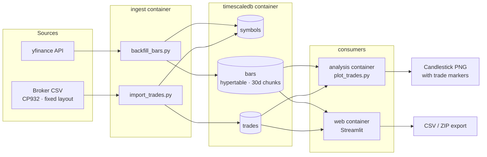

# Trading Data Pipeline

A personal trading data pipeline for JP equities that ingests OHLCV market data, overlays trade executions onto candlestick charts, and streamlines post-trade analysis.

## Tech Stack

Python, PostgreSQL/TimescaleDB, psycopg, pandas, yfinance, mplfinance, Streamlit, Docker Compose

## Architecture



All services run under Docker Compose. Both ingestion paths are idempotent:
`bars` is deduplicated by `(symbol_id, ts, timeframe)` and `trades` by the
normalized broker order reference `source_ref`, so re-running an import is safe.
Database and dashboard ports are bound to `127.0.0.1` only.

## Key Features

- **Market Data Ingestion**: Downloads hourly OHLCV data from yfinance and stores it in a TimescaleDB hypertable.
- **Trade Ingestion**: Parses CP932-encoded broker CSV exports and normalizes trade records before insertion.
- **Idempotent Storage**: Uses database constraints and conflict handling to make repeated imports safe.
- **Analysis and Export**: Displays candlestick charts with trade markers in Streamlit and exports trades and bars as CSV or ZIP files.

## Getting Started

### 1. Environment Setup

1. Copy `.env.example` to `.env` and update the database settings.
2. Create a `data/` directory and place a compatible CP932-encoded broker CSV file in `data/`.
3. Set `TRADE_CSV_PATH` in `.env` to the CSV path inside the container.

### 2. Services Initialization

Build the application images:
```bash
docker compose build
```

Start TimescaleDB (on the first start, `schema.sql` is applied automatically):
```bash
docker compose up -d timescaledb
```

Check the database logs and wait until PostgreSQL reports that it is ready to accept connections:
```bash
docker compose logs timescaledb
```

### 3. Pipeline Execution

Import trades:
```bash
docker compose run --rm ingest python import_trades.py
```

Refresh market data for all imported symbols:
```bash
docker compose run --rm ingest python backfill_bars.py
```

Generate a static chart from the command line:
```bash
docker compose run --rm analysis python plot_trades.py
```

### 4. Run Dashboard

Start the Streamlit dashboard:
```bash
docker compose up -d web
```

Open your browser and navigate to: **`http://localhost:8501`**

## Privacy

This project contains no real trading credentials, sensitive personal data, or private financial records.

## Current Limitations

- The CSV parser depends on a fixed CP932 broker-export layout.
- Each chart interval currently displays at most one trade marker per side.
- Automated tests, scheduling, and CI/CD have not yet been implemented.

## Roadmap

- [x] **Phase 1** — TimescaleDB schema and Docker Compose environment
- [x] **Phase 2** — Broker CSV ingestion and idempotent trade storage
- [x] **Phase 3** — OHLCV backfill and static candlestick charts
- [x] **Phase 4** — Streamlit dashboard and data exports
- [ ] **Phase 5** — Automated tests and CI
- [ ] **Phase 6** — Scheduled and incremental ingestion