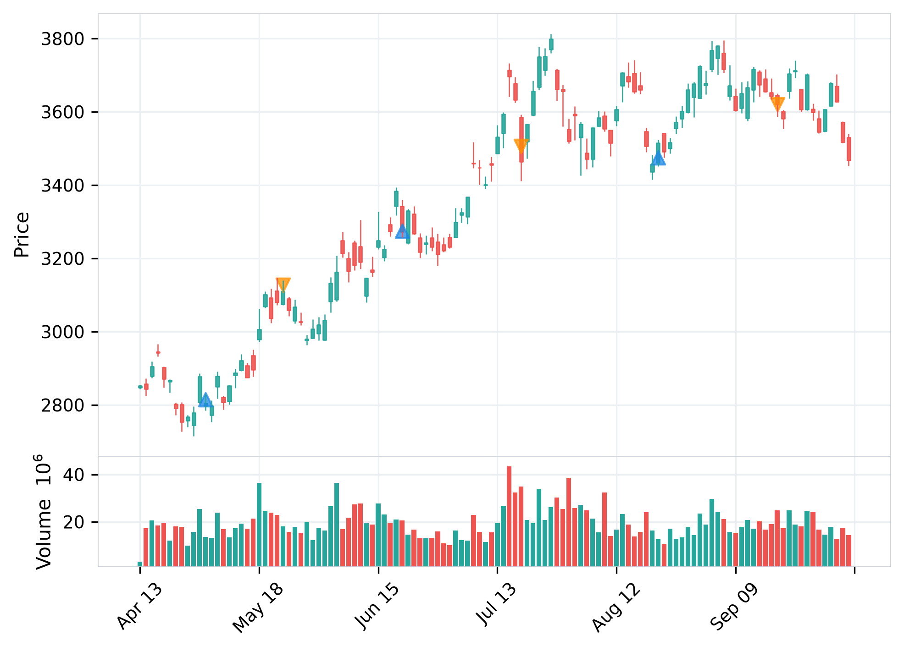
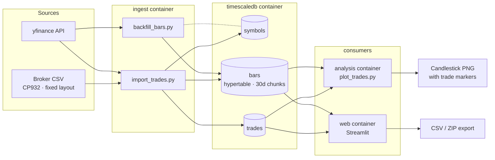

# Trading Data Pipeline

A personal trading data pipeline for JP equities that ingests OHLCV market data, overlays trade executions onto candlestick charts, and streamlines post-trade analysis.

> **概要（日本語）**　日本株の時間足データ（yfinance）と証券会社の約定 CSV を TimescaleDB に冪等に取り込み、ローソク足チャート上に売買ポイントを重ねて振り返るための個人開発データパイプラインです。Docker Compose で動作し、Terraform による AWS EC2 へのデプロイと、再起動後の自動復旧を確認済みです。

## Demo

Example chart for 8306.T, using yfinance market data and synthetic trade executions.



Blue upward triangles indicate buys; orange downward triangles indicate sells.

## Tech Stack

Python, PostgreSQL/TimescaleDB, psycopg, pandas, yfinance, mplfinance, Streamlit, Docker Compose, Terraform, AWS EC2, pytest, cloud-init

## Architecture



Solid arrows indicate data flow and writes. The dotted line indicates that `backfill_bars.py` only reads registered symbols; new symbols are created only by `import_trades.py`. The dashboard can also refresh `bars` for registered symbols through the same backfill logic.

All services run under Docker Compose. Both ingestion paths are idempotent:
`bars` are upserted on `(symbol_id, ts, timeframe)` so matching records are updated,
and `trades` are deduplicated by the normalized broker order reference `source_ref`,
so re-running an import is safe.
Database and dashboard ports are bound to `127.0.0.1` only.

## Key Features

- **Market Data Ingestion**: Downloads hourly OHLCV data from yfinance and stores it in a TimescaleDB hypertable.
- **Trade Ingestion**: Parses CP932-encoded broker CSV exports and normalizes trade records before insertion.
- **Idempotent Storage**: Uses database constraints and conflict handling to make repeated imports safe.
- **Analysis and Export**: Displays candlestick charts with trade markers in Streamlit and exports trades and bars as CSV or ZIP files.

## AWS Deployment

Terraform provisions a VPC, public subnet, internet gateway, routes, security group, key pair, and EC2 instance in `ap-northeast-1`.

On first boot, EC2 user data installs Docker, Compose, and Git, clones this repository, generates a local `.env`, builds the application images, and starts TimescaleDB and Streamlit through Docker Compose. CSV import is performed manually.

Database and dashboard ports bind to localhost. Streamlit is accessed through an SSH tunnel.

Deployment was verified in October 2026 through cloud-init and bootstrap logs, database queries, dashboard rendering, PNG generation, and an EC2 reboot. Docker and the persistent containers recovered automatically, with database records preserved.

## Quick Start

### Local Docker

Prerequisites: Git, Docker, and Docker Compose. Run the commands from the cloned repository root.

Copy the environment template:

```bash
cp .env.example .env
```

Set your own `POSTGRES_PASSWORD` in `.env`. Keep `TRADE_CSV_PATH=/data/example.csv` to use the included synthetic sample.

Build the application images, start the persistent services, and import the sample:

```bash
docker compose --parallel 1 build ingest analysis web
docker compose up -d --wait timescaledb web
docker compose run --rm ingest python import_trades.py
```

Open `http://127.0.0.1:8501` to view the dashboard.

To generate a static PNG:

```bash
docker compose run --rm analysis python plot_trades.py
```

Enter `8306.T` when prompted. The output is saved to `data/charts/8306_T_trades.png`.

### AWS EC2

Requires Terraform 1.16.x, configured AWS credentials, and an SSH key pair.

Copy `infra/terraform.tfvars.example` to `infra/terraform.tfvars`. Set the absolute public-key path and your public IPv4 address with `/32`.

```bash
terraform -chdir=infra init
terraform -chdir=infra apply
```

Review the plan before confirming resource creation.

Replace the placeholders and connect through an SSH tunnel:

```bash
ssh -i "<PRIVATE_KEY_PATH>" -o ServerAliveInterval=30 -L 127.0.0.1:18501:127.0.0.1:8501 ubuntu@<EC2_PUBLIC_IP>
```

On EC2, wait for bootstrap and import the sample:

```bash
sudo cloud-init status --wait
cd /opt/trading-data-pipeline
sudo docker compose run --rm ingest python import_trades.py
```

Keep SSH open and visit `http://127.0.0.1:18501`.

The root EBS volume is retained on termination to avoid accidental data loss.
After `terraform -chdir=infra destroy`, delete the retained volume in the EC2 console to stop storage charges.
The instance is created on demand for demonstrations and is not kept running.

## Privacy

This project contains no real trading credentials, sensitive personal data, or private financial records.

## Tests

With the project dependencies and pytest installed:

```bash
python -m pytest -q
```

## Current Limitations

- The CSV parser depends on a fixed CP932 broker-export layout.
- Each chart interval currently displays at most one trade marker per side.
- Unit tests cover order-reference normalization, symbol lookup (with a test double), and trade-marker alignment; database integration tests, scheduling, and CI/CD have not yet been implemented.
- Single EC2 instance without high availability; Terraform state is stored locally (no remote backend).
- Access is SSH-tunnel only; no public HTTPS endpoint.
- Existing `source_ref` values are skipped; reimporting a corrected CSV does not update existing trades.
- The dashboard displays the last 180 days. The synthetic sample has fixed dates, so older sample trades may fall outside the display window over time.

## Roadmap

- [x] **Phase 1** — TimescaleDB schema and Docker Compose environment
- [x] **Phase 2** — Broker CSV ingestion and idempotent trade storage
- [x] **Phase 3** — OHLCV backfill and static candlestick charts
- [x] **Phase 4** — Streamlit dashboard and data exports
- [x] **Phase 5** — Terraform-provisioned AWS EC2 deployment with first-boot bootstrap
- [ ] **Phase 6** — Expand automated tests and add CI
- [ ] **Phase 7** — Scheduled and incremental ingestion
